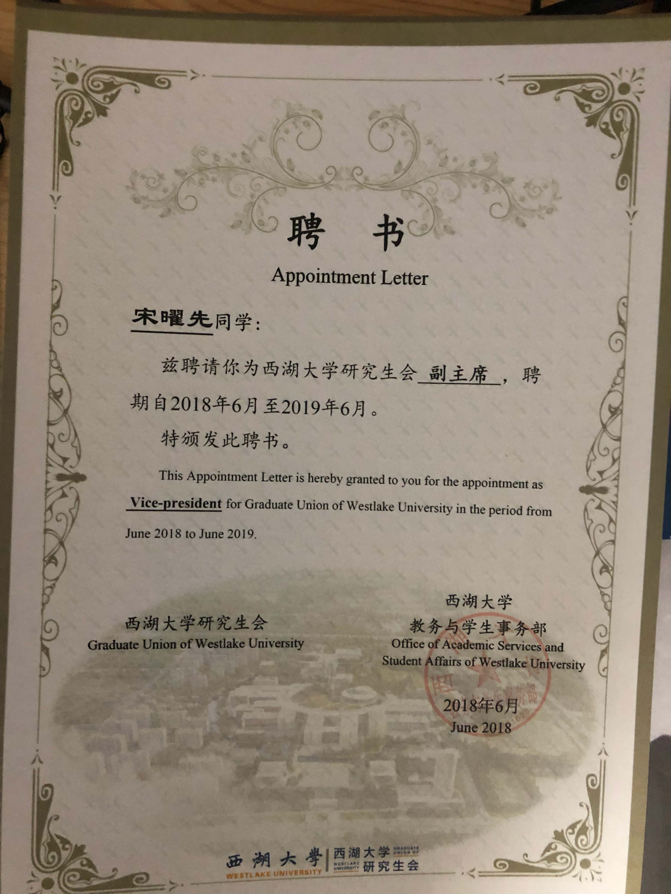

<!-- **Create a free website with Academic using Markdown, Jupyter, or RStudio. Choose a beautiful color theme and build anything with the Page Builder - over 40 _widgets_, _themes_, and _language packs_ included!**

[Check out the latest **demo**](https://academic-demo.netlify.com/) of what you'll get in less than 10 minutes, or [view the **showcase**](https://sourcethemes.com/academic/#expo) of personal, project, and business sites.

- [**Setup Academic**](#install)
- [**Get Started**](https://sourcethemes.com/academic/docs/get-started/)
- [View the documentation](https://sourcethemes.com/academic/docs/)
- [Ask a question](http://discuss.gohugo.io/)
- [Request a feature or report a bug](https://github.com/gcushen/hugo-academic/issues)
- Updating? View the [Update Guide](https://sourcethemes.com/academic/docs/update/) and [Release Notes](https://sourcethemes.com/academic/updates/)
- Support development of Academic:
  - [Donate a coffee](https://paypal.me/cushen)
  - [Become a backer on Patreon](https://www.patreon.com/cushen)
  - [Decorate your laptop or journal with an Academic sticker](https://www.redbubble.com/people/neutreno/works/34387919-academic)
  - [Wear the T-shirt](https://academic.threadless.com/)

 -->

 

